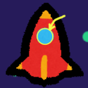
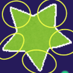

# Star Fall

## About - 概要
これは私自身が初めて作り切ったゲームです。システム構築を試してみたくて作ったためグラフィック等には注視していません。

ゲームの種類は避けゲーです。ロケットを操作して上から落ちてくる星々をどれだけ避けれるかを試すゲームになります。

## Hou to use - 起動方法
[Releaseページ](https://github.com/mtytheone/StarFall/releases/)からZipファイルをダウンロードしてexeファイルを起動すると遊べます。

## How to operate - 操作方法
キーボードのみに対応しており、WASDもしくは矢印キーで動かせます。
- Z キー : 決定
- W キー or 上矢印キー : 上方向に移動
- S キー or 下矢印キー : 下方向に移動
- A キー or 左矢印キー : 左方向に移動
- D キー or 右矢印キー : 右方向に移動
- Shift キー : 低速移動

## ちょっとした仕様 - Tips
- ロケットの当たり判定は真ん中の青い窓部分のみになります。

- 一方で星は中心部分にしか当たり判定がありません。これを利用して上手く避けてください。
つまり下記画像でいう、黄色い丸で囲った部分には当たり判定がありません。
（丸の囲い方はだいたいで囲ってます）

## ライセンス - License
このゲーム、プロジェクト及びソースファイルは **GNU General Public License v3.0** ライセンスに乗っ取ります。

- [ライセンス原文](https://github.com/mtytheone/StarFall/blob/master/LICENSE.md)

- [ライセンスページ](https://choosealicense.com/licenses/gpl-3.0/)

また、ツイートボタンの画像はTwitter社の商標であり、ロケット及び星の画像の著作権はみふねたかしが所有しています。